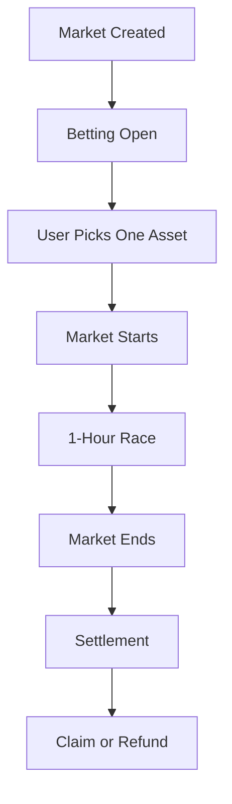
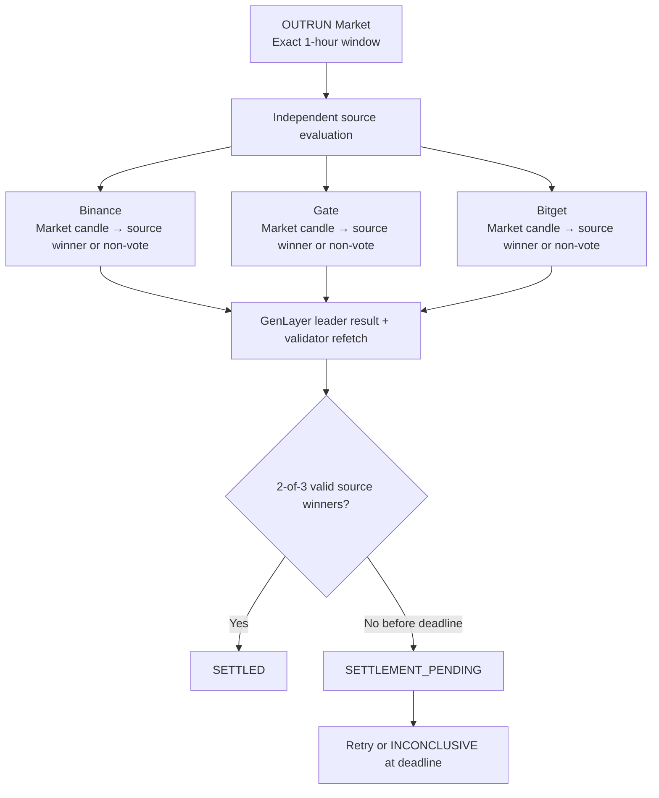

# OUTRUN

> One wallet. One pick. One hour to outrun the field.

OUTRUN is a GenLayer-powered one-hour index-dominance prediction market. Each
market contains three fixed assets, and participants predict which asset will
produce the strongest percentage return during the same exact one-hour window.

## What is OUTRUN?

OUTRUN turns relative performance into a simple prediction market. A market is
created for a future UTC-aligned hour, users stake native GEN on one eligible
asset, and the contract settles the result from independent market data after
the window ends.

The result is based on percentage return, not the largest absolute price or a
positive-versus-negative threshold. This means a market can have a winner even
when all three assets decline.

## Why OUTRUN?

Most simple price predictions ask whether one asset goes up or down. OUTRUN
asks which member of a small, fixed basket performs best relative to the other
two over the same window.

The design keeps that question focused through fixed one-hour markets,
one-wallet-one-pick commitments, deterministic pool accounting, and
independent multi-source settlement. There are no user-defined baskets,
order-book mechanics, or side switching.

## How It Works

1. Anyone creates a market for one of the fixed categories and a future UTC
   hour.
2. Before the start timestamp, a wallet selects one asset and places a GEN
   stake. That selection is locked for the market.
3. The three assets compete during the exact 3,600-second window.
4. After the window, the contract requests source evaluations and applies its
   consensus rules.
5. Winning positions claim their proportional payout. If the market becomes
   inconclusive, participants claim refunds of their original stakes.



## Markets

OUTRUN V1 has exactly three categories. The category determines the asset
basket; callers cannot replace it with a custom basket.

| Category ID | Category | Assets |
|---:|---|---|
| `0` | US Indices | SPY · QQQ · IWM |
| `1` | Asia Indices | EWJ · EWY · EWT |
| `2` | Sector Indices | SMH · XBI · XLE |

Every market lasts exactly one hour. Market creation accepts only a category
and a future start timestamp aligned to an exact UTC hour. A category/start
pair can be created only once.

## Betting Rules

- The minimum payable stake is **1 GEN** (`1e18` native units).
- A wallet's cumulative stake is capped at **20 GEN per market**.
- The first valid asset selected by a wallet becomes its permanent pick for
  that market.
- Same-side top-ups are allowed while the market is open, up to the 20 GEN
  cumulative limit.
- A bet on another asset is rejected. There is no cancellation or side
  switching.
- Betting closes when the current time reaches the market start timestamp.

The contract charges no protocol fee in V1 (`fee_bps = 0`).

## How a Winner Is Determined

For every asset and source, the contract evaluates:

```text
return = (close_price - open_price) / open_price
```

Prices are parsed into fixed-point integers. The source evidence includes
return units at the contract's configured precision, while winner selection
compares the return ratios using integer cross-multiplication. No floating-point
arithmetic is used for the consensus-critical ranking.

The numerically highest return wins. For example:

```text
SPY  -0.40%
QQQ  -0.85%
IWM  -0.20%
```

IWM wins because `-0.20%` is higher than both `-0.40%` and `-0.85%`. A source
tie produces no valid winner vote.

## Settlement

Settlement uses one exact one-hour candle for each of the three assets. The
contract derives the candle start from `market_start` and the end from
`market_start + 3,600` seconds; settlement-call time does not define the
competition window.

| Source | Feed | Symbol format |
|---|---|---|
| Binance | USDⓈ-M perpetual market klines at `/fapi/v1/klines` | `SPYUSDT` |
| Gate | USDT-M futures market candlesticks at `/api/v4/futures/usdt/candlesticks` | `SPY_USDT` |
| Bitget | USDT futures market candles at `/api/v3/market/candles`, `type=market` | `SPYUSDT` |

The contract validates source identity, category, asset mapping, timestamp,
interval, response shape, and positive open/close prices before accepting a
source result. Each source independently determines a winner from its three
asset returns. Only valid source winners vote, and two matching valid winners
are enough to resolve the market.

If the sources do not yet provide a valid 2-of-3 result, the market remains
`SETTLEMENT_PENDING` and can be retried. At or after the settlement deadline,
which is four hours after market end, it becomes `INCONCLUSIVE`. A consensus
winner with no backing in a non-empty pool also follows the inconclusive refund
path.



## Payouts and Refunds

In a settled market, each winning wallet claims its share of the total pool:

```text
payout = floor(stake × total_pool / winning_pool)
```

The contract uses integer floor rounding. The final winning claimant receives
the remaining pool balance, which accounts for rounding dust. Losing wallets
cannot claim. In an `INCONCLUSIVE` market, each position can claim back its
original stake once.

## Why GenLayer?

OUTRUN needs external market data, but a caller must not be able to choose the
prices that determine the result. GenLayer provides the execution model for
handling that nondeterministic boundary:

- The contract performs web requests through GenLayer's nondeterministic web
  interface.
- For each source, a leader obtains the evidence and a validator independently
  refetches and validates the same source, symbols, category, and window.
- The contract accepts the nondeterministic result only when the evidence keys
  match, then performs the source-to-source 2-of-3 decision deterministically.
- Persistent state is mutated after the consensus result is obtained; callers
  submit only the market ID and cannot submit authoritative prices or URLs.

This separates external-data retrieval from the deterministic accounting that
records a winner, payout liability, or refund state.

## Architecture

The frontend presents markets and wallet actions. The OUTRUN intelligent
contract owns category configuration, lifecycle timestamps, bets, pools,
settlement evidence, claims, and refunds. GenLayer consensus validates the
nondeterministic source evaluations, which read the locked market-data feeds
from Binance, Gate, and Bitget.

The contract source is pinned to `py-genlayer:5jycge4q8k23462jtb0b9fyey1s9qz928sz2nbrd9mg4sxqg2qng` in its first line. The intended interactive environment is GenLayer Studio Next / Studio-dev; this repository does not contain a populated network deployment configuration.

## Contract Interface

The constructor takes no arguments. Public methods are grouped below by role.
The `u256` parameters are the contract's unsigned integer ABI type.

### Market

| Method | Type | Description |
|---|---|---|
| `create_market(category, market_start)` | write | Creates a unique future market for a fixed category and exact UTC-hour start. |
| `categories()` | view | Returns the three supported category identifiers. |
| `category_assets(category)` | view | Returns the fixed three-asset basket for a category. |
| `get_config()` | view | Returns protocol constants, sources, precision, limits, and payout policy. |
| `get_market(market_id)` | view | Returns one market's lifecycle, pools, winner, and settlement accounting. |
| `get_markets(offset, limit)` | view | Returns a bounded page of markets. |
| `get_open_markets(offset, limit)` | view | Returns a bounded page of markets currently open for betting. |
| `get_market_count()` | view | Returns the number of created markets. |
| `get_market_by_category_start(category, market_start)` | view | Looks up the unique market for a category/start pair. |

### Betting

| Method | Type | Description |
|---|---|---|
| `place_bet(market_id, asset)` | payable write | Places a GEN bet or adds a same-asset top-up, subject to the market and wallet rules. |
| `get_my_position(market_id)` | view | Returns the caller's selected asset, stake, result, and claim/refund availability. |
| `get_betting_state(market_id)` | view | Returns caller-specific betting state and market pool accounting. |
| `get_my_market_count()` | view | Returns the caller's number of markets with a position. |
| `get_my_positions(offset, limit)` | view | Returns a bounded page of the caller's positions. |
| `get_my_claimable_markets(offset, limit)` | view | Returns a bounded page of positions with a claim or refund available. |

### Settlement

| Method | Type | Description |
|---|---|---|
| `settle_market(market_id)` | write | Evaluates the exact window, applies source consensus, and advances the market state. |
| `get_source_evidence(market_id, source)` | view | Returns stored evidence for one locked settlement source. |

### Claims / refunds

| Method | Type | Description |
|---|---|---|
| `claim(market_id)` | write | Pays a winning position its pari-mutuel share of the pool. |
| `claim_refund(market_id)` | write | Returns the original stake for a position in an inconclusive market. |

### Views

| Method | Type | Description |
|---|---|---|
| `get_my_activity_count()` | view | Returns the caller's onchain activity record count. |
| `get_my_activity(offset, limit)` | view | Returns a bounded page of the caller's onchain activity records. |

## Security / Design Constraints

- Category baskets, symbols, sources, timestamps, and candle intervals are
  contract-defined rather than caller-defined.
- Settlement callers provide only a market ID; they cannot provide prices,
  URLs, or substitute a source or symbol.
- Source evidence is checked against the expected source, category, assets, and
  exact market window, with independent validator refetch.
- One-wallet-one-side and the cumulative 20 GEN cap are enforced in the
  payable contract method.
- Persistent state uses keyed `TreeMap` storage and scalar counters. Reads are
  paginated with a maximum page size of 50; historical storage has explicit
  market, position, and activity bounds.
- Claim and refund flags prevent duplicate withdrawals, and payout accounting
  tracks consumed pool balances.
- Payouts use integer floor rounding. The final winning claimant receives the
  remaining pool balance so rounding dust is not stranded.

## Running the Project

### Frontend

The frontend is a Vite application with npm scripts:

```bash
cd frontend
npm install
npm run dev
```

For a production build or the repository's TypeScript validation:

```bash
npm run build
npm run lint
```

### Contract / Studio Next

Open `contracts/Outrun.py` in GenLayer Studio Next / Studio-dev using the
dependency pin declared at the top of the file. Contract interaction and
deployment are performed through Studio Next; this repository does not provide
a separate deployment command or populated local network configuration.

## Project Structure

```text
OUTRUN/
├── contracts/
│   └── Outrun.py
├── frontend/
│   ├── src/
│   ├── package.json
│   └── vite.config.ts
├── tests/
│   ├── direct/
│   └── integration/
├── gltest.config.yaml
├── requirements.txt
└── README.md
```

## Status

OUTRUN V1's intelligent contract is implemented in `contracts/Outrun.py`, with
a separate frontend scaffold in `frontend/`. The repository contains the
contract test layout and frontend validation scripts; network deployment and
live contract configuration are not included in this repository snapshot.
